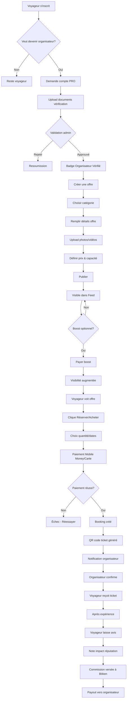

# 🎯 BŌKEN - Architecture B2B2C Complète

## 1️⃣ Principe Fondamental

**Les voyageurs sont l'audience. Les organisateurs sont les clients.**

- **UX prioritaire** = Organisateur
- **Features premium** = Organisateur  
- **Revenus** = Organisateur
- **Voyageurs** = Croissance & Volume
- **Bōken gagne quand un organisateur vend**

---

## 2️⃣ Architecture Système

### 🏗️ Stack Technique

#### Frontend
```yaml
Framework: Flutter (iOS + Android)
Architecture: Clean Architecture
State Management: flutter_bloc (déjà en place)
Navigation: go_router
Responsive: flutter_screenutil (déjà configuré)
```

#### Backend
```yaml
API: NestJS / Node.js (TypeScript)
Database: PostgreSQL + Firestore (hybride)
Auth: Firebase Auth + Custom JWT
Storage: Firebase Storage
Real-time: Firestore + WebSocket
Payment: Mobile Money API + Stripe
```

#### Infrastructure
```yaml
Hosting: Cloud Run / Railway
Database: Supabase / Cloud SQL
CDN: CloudFlare
Admin: Retool / Custom Admin Panel
Analytics: Mixpanel + Firebase Analytics
```

---

## 3️⃣ Base de Données - Schéma PostgreSQL

### Table: `users`
```sql
CREATE TABLE users (
    id UUID PRIMARY KEY DEFAULT gen_random_uuid(),
    firebase_uid VARCHAR(128) UNIQUE NOT NULL,
    email VARCHAR(255) UNIQUE NOT NULL,
    phone VARCHAR(20),
    full_name VARCHAR(255),
    avatar_url TEXT,
    bio TEXT,
    user_type VARCHAR(20) DEFAULT 'traveler' CHECK (user_type IN ('traveler', 'organizer', 'admin')),
    is_verified BOOLEAN DEFAULT false,
    created_at TIMESTAMP DEFAULT NOW(),
    updated_at TIMESTAMP DEFAULT NOW()
);

CREATE INDEX idx_users_email ON users(email);
CREATE INDEX idx_users_firebase_uid ON users(firebase_uid);
CREATE INDEX idx_users_type ON users(user_type);
```

### Table: `organizers`
```sql
CREATE TABLE organizers (
    id UUID PRIMARY KEY DEFAULT gen_random_uuid(),
    user_id UUID REFERENCES users(id) ON DELETE CASCADE,
    business_name VARCHAR(255) NOT NULL,
    business_type VARCHAR(50), -- 'individual', 'company', 'institution'
    business_registration VARCHAR(255),
    tax_id VARCHAR(100),
    verification_status VARCHAR(20) DEFAULT 'pending' CHECK (verification_status IN ('pending', 'approved', 'rejected')),
    verification_documents JSONB, -- URLs to documents
    badge_level VARCHAR(20) DEFAULT 'standard' CHECK (badge_level IN ('standard', 'verified', 'premium', 'enterprise')),
    commission_rate DECIMAL(5, 2) DEFAULT 10.00, -- % commission
    total_revenue DECIMAL(12, 2) DEFAULT 0,
    total_bookings INTEGER DEFAULT 0,
    rating_average DECIMAL(3, 2) DEFAULT 0,
    rating_count INTEGER DEFAULT 0,
    bank_account JSONB, -- Payout details
    subscription_tier VARCHAR(20) DEFAULT 'free' CHECK (subscription_tier IN ('free', 'plus', 'enterprise')),
    subscription_expires_at TIMESTAMP,
    created_at TIMESTAMP DEFAULT NOW(),
    updated_at TIMESTAMP DEFAULT NOW()
);

CREATE INDEX idx_organizers_user_id ON organizers(user_id);
CREATE INDEX idx_organizers_verification ON organizers(verification_status);
CREATE INDEX idx_organizers_badge ON organizers(badge_level);
```

### Table: `offers`
```sql
CREATE TABLE offers (
    id UUID PRIMARY KEY DEFAULT gen_random_uuid(),
    organizer_id UUID REFERENCES organizers(id) ON DELETE CASCADE,
    category VARCHAR(50) NOT NULL CHECK (category IN ('event', 'tour', 'accommodation', 'transport', 'site')),
    title VARCHAR(255) NOT NULL,
    description TEXT,
    media_urls JSONB, -- Array of image/video URLs
    location_name VARCHAR(255),
    location_coords POINT, -- PostGIS
    price_min DECIMAL(10, 2),
    price_max DECIMAL(10, 2),
    currency VARCHAR(3) DEFAULT 'XOF',
    
    -- Event/Tour specific
    event_date TIMESTAMP,
    event_end_date TIMESTAMP,
    capacity INTEGER,
    available_spots INTEGER,
    
    -- Accommodation specific
    check_in_time TIME,
    check_out_time TIME,
    amenities JSONB,
    
    -- Transport specific
    vehicle_type VARCHAR(50),
    route_from VARCHAR(255),
    route_to VARCHAR(255),
    
    -- Status & visibility
    status VARCHAR(20) DEFAULT 'draft' CHECK (status IN ('draft', 'published', 'sold_out', 'cancelled', 'archived')),
    is_featured BOOLEAN DEFAULT false,
    boost_expires_at TIMESTAMP,
    views_count INTEGER DEFAULT 0,
    likes_count INTEGER DEFAULT 0,
    bookings_count INTEGER DEFAULT 0,
    
    created_at TIMESTAMP DEFAULT NOW(),
    updated_at TIMESTAMP DEFAULT NOW()
);

CREATE INDEX idx_offers_organizer ON offers(organizer_id);
CREATE INDEX idx_offers_category ON offers(category);
CREATE INDEX idx_offers_status ON offers(status);
CREATE INDEX idx_offers_featured ON offers(is_featured);
CREATE INDEX idx_offers_location ON offers USING GIST(location_coords);
```

### Table: `bookings`
```sql
CREATE TABLE bookings (
    id UUID PRIMARY KEY DEFAULT gen_random_uuid(),
    offer_id UUID REFERENCES offers(id) ON DELETE RESTRICT,
    user_id UUID REFERENCES users(id) ON DELETE RESTRICT,
    organizer_id UUID REFERENCES organizers(id) ON DELETE RESTRICT,
    
    booking_type VARCHAR(50), -- 'instant', 'request'
    status VARCHAR(20) DEFAULT 'pending' CHECK (status IN ('pending', 'confirmed', 'cancelled', 'completed', 'refunded')),
    
    quantity INTEGER DEFAULT 1,
    total_price DECIMAL(10, 2) NOT NULL,
    commission DECIMAL(10, 2) NOT NULL,
    organizer_payout DECIMAL(10, 2) NOT NULL,
    
    booking_date TIMESTAMP,
    check_in_date DATE,
    check_out_date DATE,
    
    payment_status VARCHAR(20) DEFAULT 'pending' CHECK (payment_status IN ('pending', 'paid', 'failed', 'refunded')),
    payment_method VARCHAR(50),
    transaction_id VARCHAR(255) UNIQUE,
    
    qr_code TEXT, -- Generated QR for ticket
    booking_code VARCHAR(20) UNIQUE NOT NULL,
    
    customer_details JSONB, -- Name, phone, special requests
    
    created_at TIMESTAMP DEFAULT NOW(),
    updated_at TIMESTAMP DEFAULT NOW()
);

CREATE INDEX idx_bookings_offer ON bookings(offer_id);
CREATE INDEX idx_bookings_user ON bookings(user_id);
CREATE INDEX idx_bookings_organizer ON bookings(organizer_id);
CREATE INDEX idx_bookings_status ON bookings(status);
CREATE INDEX idx_bookings_code ON bookings(booking_code);
```

### Table: `reviews`
```sql
CREATE TABLE reviews (
    id UUID PRIMARY KEY DEFAULT gen_random_uuid(),
    booking_id UUID REFERENCES bookings(id) ON DELETE CASCADE,
    offer_id UUID REFERENCES offers(id) ON DELETE CASCADE,
    organizer_id UUID REFERENCES organizers(id) ON DELETE CASCADE,
    user_id UUID REFERENCES users(id) ON DELETE CASCADE,
    
    rating INTEGER NOT NULL CHECK (rating >= 1 AND rating <= 5),
    comment TEXT,
    photos JSONB,
    
    is_verified BOOLEAN DEFAULT false, -- Only from actual bookings
    is_visible BOOLEAN DEFAULT true,
    
    created_at TIMESTAMP DEFAULT NOW(),
    updated_at TIMESTAMP DEFAULT NOW(),
    
    UNIQUE(booking_id) -- One review per booking
);

CREATE INDEX idx_reviews_offer ON reviews(offer_id);
CREATE INDEX idx_reviews_organizer ON reviews(organizer_id);
CREATE INDEX idx_reviews_rating ON reviews(rating);
```

### Table: `boost_campaigns`
```sql
CREATE TABLE boost_campaigns (
    id UUID PRIMARY KEY DEFAULT gen_random_uuid(),
    organizer_id UUID REFERENCES organizers(id) ON DELETE CASCADE,
    offer_id UUID REFERENCES offers(id) ON DELETE CASCADE,
    
    campaign_type VARCHAR(20) CHECK (campaign_type IN ('feed', 'explore', 'guide', 'top')),
    budget DECIMAL(10, 2) NOT NULL,
    duration_days INTEGER NOT NULL,
    
    status VARCHAR(20) DEFAULT 'active' CHECK (status IN ('draft', 'active', 'paused', 'completed', 'cancelled')),
    
    impressions INTEGER DEFAULT 0,
    clicks INTEGER DEFAULT 0,
    conversions INTEGER DEFAULT 0,
    
    starts_at TIMESTAMP NOT NULL,
    ends_at TIMESTAMP NOT NULL,
    
    created_at TIMESTAMP DEFAULT NOW(),
    updated_at TIMESTAMP DEFAULT NOW()
);

CREATE INDEX idx_boost_organizer ON boost_campaigns(organizer_id);
CREATE INDEX idx_boost_offer ON boost_campaigns(offer_id);
CREATE INDEX idx_boost_status ON boost_campaigns(status);
```

### Table: `payouts`
```sql
CREATE TABLE payouts (
    id UUID PRIMARY KEY DEFAULT gen_random_uuid(),
    organizer_id UUID REFERENCES organizers(id) ON DELETE RESTRICT,
    
    amount DECIMAL(12, 2) NOT NULL,
    currency VARCHAR(3) DEFAULT 'XOF',
    
    status VARCHAR(20) DEFAULT 'pending' CHECK (status IN ('pending', 'processing', 'completed', 'failed')),
    
    period_start DATE NOT NULL,
    period_end DATE NOT NULL,
    
    booking_ids JSONB, -- Array of booking IDs included
    
    payment_method VARCHAR(50),
    transaction_reference VARCHAR(255),
    
    created_at TIMESTAMP DEFAULT NOW(),
    processed_at TIMESTAMP
);

CREATE INDEX idx_payouts_organizer ON payouts(organizer_id);
CREATE INDEX idx_payouts_status ON payouts(status);
```

---

## 4️⃣ API Endpoints (NestJS)

### Auth Module

```typescript
POST   /api/auth/register           // Register traveler
POST   /api/auth/register-organizer // Register organizer (with verification)
POST   /api/auth/login
POST   /api/auth/refresh
POST   /api/auth/verify-email
POST   /api/auth/reset-password
```

### User Module

```typescript
GET    /api/users/me
PATCH  /api/users/me
GET    /api/users/:id/profile
POST   /api/users/become-organizer  // Switch to organizer
```

### Organizer Module

```typescript
GET    /api/organizers/me/dashboard          // Stats & analytics
GET    /api/organizers/me/offers             // My offers
GET    /api/organizers/me/bookings           // My bookings
GET    /api/organizers/me/reviews            // My reviews
GET    /api/organizers/me/earnings           // Revenue breakdown
GET    /api/organizers/me/payouts            // Payout history
POST   /api/organizers/me/verification       // Submit verification docs
PATCH  /api/organizers/me
```

### Offers Module

```typescript
POST   /api/offers                           // Create offer
GET    /api/offers                           // List all (with filters)
GET    /api/offers/:id
PATCH  /api/offers/:id
DELETE /api/offers/:id
POST   /api/offers/:id/publish
POST   /api/offers/:id/boost                 // Create boost campaign
GET    /api/offers/:id/analytics             // Offer performance
```

### Bookings Module

```typescript
POST   /api/bookings                         // Create booking
GET    /api/bookings/me                      // My bookings (traveler)
GET    /api/bookings/:id
PATCH  /api/bookings/:id/confirm             // Organizer confirms
PATCH  /api/bookings/:id/cancel
POST   /api/bookings/:id/review              // After completion
GET    /api/bookings/:id/qr                  // Get ticket QR
POST   /api/bookings/:id/verify              // Scan & verify ticket
```

### Payment Module

```typescript
POST   /api/payments/initialize              // Start payment
POST   /api/payments/webhook/mobile-money    // Payment callback
POST   /api/payments/webhook/stripe
GET    /api/payments/:id/status
POST   /api/payments/refund/:bookingId
```

### Feed Module

```typescript
GET    /api/feed                             // Personalized feed
GET    /api/feed/explore                     // Explore by location
GET    /api/feed/trending
POST   /api/feed/like/:offerId
POST   /api/feed/save/:offerId
```

### Admin Module

```typescript
GET    /api/admin/organizers/pending         // Pending verification
PATCH  /api/admin/organizers/:id/verify
GET    /api/admin/analytics
GET    /api/admin/payouts/pending
POST   /api/admin/payouts/:id/process
```

---

## 5️⃣ Flutter - Architecture Clean

### Structure de dossiers

```
lib/
├── main.dart
├── firebase_options.dart
├── core/
│   ├── constants/
│   │   ├── app_constants.dart
│   │   └── api_constants.dart
│   ├── di/
│   │   └── injection.dart         # GetIt service locator
│   ├── theme/
│   ├── widgets/
│   ├── utils/
│   ├── error/
│   │   ├── failures.dart
│   │   └── exceptions.dart
│   └── network/
│       ├── api_client.dart
│       └── network_info.dart
│
├── features/
│   ├── auth/
│   │   ├── data/
│   │   │   ├── datasources/
│   │   │   │   └── auth_remote_data_source.dart
│   │   │   ├── models/
│   │   │   │   ├── user_model.dart
│   │   │   │   └── organizer_model.dart
│   │   │   └── repositories/
│   │   │       └── auth_repository_impl.dart
│   │   ├── domain/
│   │   │   ├── entities/
│   │   │   │   ├── user.dart
│   │   │   │   └── organizer.dart
│   │   │   ├── repositories/
│   │   │   │   └── auth_repository.dart
│   │   │   └── usecases/
│   │   │       ├── login.dart
│   │   │       ├── register.dart
│   │   │       └── become_organizer.dart
│   │   └── presentation/
│   │       ├── bloc/
│   │       │   ├── auth_bloc.dart
│   │       │   ├── auth_event.dart
│   │       │   └── auth_state.dart
│   │       └── pages/
│   │           ├── login_page.dart
│   │           ├── register_page.dart
│   │           └── become_organizer_page.dart
│   │
│   ├── organizer_dashboard/
│   │   ├── data/
│   │   │   ├── datasources/
│   │   │   │   └── dashboard_remote_data_source.dart
│   │   │   ├── models/
│   │   │   │   ├── dashboard_stats_model.dart
│   │   │   │   └── earnings_model.dart
│   │   │   └── repositories/
│   │   │       └── dashboard_repository_impl.dart
│   │   ├── domain/
│   │   │   ├── entities/
│   │   │   │   ├── dashboard_stats.dart
│   │   │   │   └── earnings.dart
│   │   │   ├── repositories/
│   │   │   │   └── dashboard_repository.dart
│   │   │   └── usecases/
│   │   │       ├── get_dashboard_stats.dart
│   │   │       └── get_earnings.dart
│   │   └── presentation/
│   │       ├── bloc/
│   │       │   ├── dashboard_bloc.dart
│   │       │   ├── dashboard_event.dart
│   │       │   └── dashboard_state.dart
│   │       ├── pages/
│   │       │   ├── dashboard_home_page.dart
│   │       │   ├── my_offers_page.dart
│   │       │   ├── earnings_page.dart
│   │       │   └── analytics_page.dart
│   │       └── widgets/
│   │           ├── stat_card.dart
│   │           ├── revenue_chart.dart
│   │           └── booking_list_item.dart
│   │
│   ├── offers/
│   │   ├── data/
│   │   │   ├── datasources/
│   │   │   ├── models/
│   │   │   │   └── offer_model.dart
│   │   │   └── repositories/
│   │   ├── domain/
│   │   │   ├── entities/
│   │   │   │   └── offer.dart
│   │   │   ├── repositories/
│   │   │   └── usecases/
│   │   │       ├── create_offer.dart
│   │   │       ├── get_offers.dart
│   │   │       ├── update_offer.dart
│   │   │       └── boost_offer.dart
│   │   └── presentation/
│   │       ├── bloc/
│   │       ├── pages/
│   │       │   ├── create_offer_page.dart
│   │       │   ├── offer_detail_page.dart
│   │       │   └── boost_offer_page.dart
│   │       └── widgets/
│   │           ├── offer_form.dart
│   │           └── category_selector.dart
│   │
│   ├── bookings/
│   │   ├── data/
│   │   ├── domain/
│   │   │   ├── entities/
│   │   │   │   └── booking.dart
│   │   │   └── usecases/
│   │   │       ├── create_booking.dart
│   │   │       ├── confirm_booking.dart
│   │   │       └── cancel_booking.dart
│   │   └── presentation/
│   │       ├── bloc/
│   │       ├── pages/
│   │       │   ├── booking_page.dart
│   │       │   ├── my_bookings_page.dart
│   │       │   └── ticket_detail_page.dart
│   │       └── widgets/
│   │           ├── booking_form.dart
│   │           ├── qr_ticket.dart
│   │           └── booking_status_badge.dart
│   │
│   ├── payments/
│   │   ├── data/
│   │   ├── domain/
│   │   │   └── usecases/
│   │   │       ├── initialize_payment.dart
│   │   │       └── verify_payment.dart
│   │   └── presentation/
│   │       ├── pages/
│   │       │   ├── payment_page.dart
│   │       │   └── payment_success_page.dart
│   │       └── widgets/
│   │           └── payment_method_selector.dart
│   │
│   ├── feed/
│   │   └── presentation/
│   │       └── pages/
│   │           └── feed_page.dart
│   │
│   └── profile/
│       └── presentation/
│           └── pages/
│               ├── profile_page.dart
│               └── organizer_profile_page.dart
```

---

## 6️⃣ Parcours Utilisateur Complet

### 🎯 Flow Organizer → Vente



### 🎯 Dashboard Organisateur - Vue clé

```
┌──────────────────────────────────────────────────────┐
│ 📊 Dashboard Organisateur                            │
├──────────────────────────────────────────────────────┤
│                                                      │
│  Ce mois                                             │
│  ┌─────────┐  ┌─────────┐  ┌─────────┐  ┌─────────┐│
│  │ 12 340  │  │   45    │  │ 98.2%   │  │ 4.8 ⭐  ││
│  │  XOF    │  │ Billets │  │  Taux   │  │ Note    ││
│  │ Revenus │  │ Vendus  │  │Confirm. │  │Moyenne  ││
│  └─────────┘  └─────────┘  └─────────┘  └─────────┘│
│                                                      │
│  📈 Ventes par événement                             │
│  ┌──────────────────────────────────────────┐       │
│  │ Festival Porto-Novo       8 500 XOF  ██  │       │
│  │ Tour Ouidah              5 200 XOF  ███  │       │
│  │ Visite Palais Royal      3 100 XOF  ████ │       │
│  └──────────────────────────────────────────┘       │
│                                                      │
│  💰 Paiements à venir                                │
│  Prochain versement: 15 Fév 2026                    │
│  Montant: 10 450 XOF                                 │
│                                                      │
│  📍 Top régions                                      │
│  🥇 Cotonou (45%)                                    │
│  🥈 Porto-Novo (30%)                                 │
│  🥉 Parakou (15%)                                    │
│                                                      │
└──────────────────────────────────────────────────────┘
```

---

## 7️⃣ Modèle de Revenus

### Phase 1 - Lancement (Commission)
```yaml
Commission: 8% par booking
Inscription PRO: Gratuite
Vérification: Manuelle
Payout: Hebdomadaire (seuil min: 5000 XOF)
```

### Phase 2 - Croissance (Boost)
```yaml
Boost Feed: 2000 XOF / 7 jours
Boost Guide Local: 5000 XOF / 30 jours
Badge "Top Expérience": 10000 XOF / événement
Paiement: One-time par campagne
```

### Phase 3 - Scale (Abonnements)
```yaml
PRO Free:
  - Commission: 8%
  - Support: Email
  - Stats: Basic

PRO Plus (15000 XOF/mois):
  - Commission: 5%
  - Support: Prioritaire
  - Stats: Avancées
  - 1 Boost/mois inclus
  
PRO Enterprise (Sur devis):
  - Commission: 3%
  - Account Manager
  - API Access
  - White label possible
```

---

## 8️⃣ KPIs à tracker

### Pour Bōken
- GMV (Gross Merchandise Value)
- Commission revenue
- Boost revenue
- Active organizers
- Active travelers
- Booking conversion rate
- Average booking value

### Pour Organisateurs
- Total revenue
- Bookings count
- Conversion rate (views → bookings)
- Average rating
- Repeat customer rate
- Payout history

---

## 9️⃣ Roadmap d'implémentation

### Sprint 1-2: Foundation (2 semaines)
- [ ] Setup backend NestJS
- [ ] Database PostgreSQL + migrations
- [ ] Auth system (User + Organizer)
- [ ] API endpoints de base
- [ ] Flutter clean architecture setup

### Sprint 3-4: Organizer Core (2 semaines)
- [ ] Become organizer flow
- [ ] Verification system
- [ ] Create offer flow
- [ ] Offer management (CRUD)
- [ ] Dashboard basic

### Sprint 5-6: Booking System (2 semaines)
- [ ] Booking creation
- [ ] Payment integration Mobile Money
- [ ] QR code generation
- [ ] Ticket verification
- [ ] Booking confirmation

### Sprint 7-8: Organizer Dashboard (2 semaines)
- [ ] Analytics page
- [ ] Revenue tracking
- [ ] Booking management
- [ ] Review management
- [ ] Payout history

### Sprint 9-10: Boost & Monetization (2 semaines)
- [ ] Boost campaigns
- [ ] Payment for boost
- [ ] Enhanced visibility
- [ ] Commission tracking
- [ ] Payout system

### Sprint 11-12: Polish & Launch (2 semaines)
- [ ] Notifications
- [ ] Reviews & ratings
- [ ] Admin panel
- [ ] Testing E2E
- [ ] Beta launch

---

## 🔥 Prompt pour Kimi K2 (Copier-Coller)

```
Tu es un développeur full-stack senior spécialisé en Flutter et backend scalable.

Je développe Bōken, une application mobile de réseau social de tourisme et de billetterie, où les organisateurs sont les clients principaux.

L'application permet :
- Comptes utilisateurs classiques (voyageurs)
- Comptes professionnels (organisateurs vérifiés)

Les comptes PRO peuvent :
- Publier des événements via posts et stories
- Vendre des billets ou proposer des réservations selon leur catégorie :
  * Visites guidées
  * Événements culturels
  * Hébergements
  * Déplacements
  * Sites touristiques
- Avoir un badge "Organisateur vérifié"
- Avoir un bouton "Acheter un billet" ou "Réserver" directement sur leurs posts

Le système inclut :
- Feed social actionnable
- Guide touristique dépendant de la localité
- Billetterie intégrée
- Tableau de bord organisateur (ventes, revenus, statistiques)

Modèle de revenus :
- Commission par billet vendu (8%)
- Boost de visibilité optionnel
- Abonnements PRO (phase ultérieure)

Je veux :
1. Une architecture Flutter propre (Clean Architecture)
2. Une API backend (NestJS) avec gestion des rôles
3. Un schéma de base de données PostgreSQL
4. Les endpoints clés
5. Le flow complet Organisateur → Billet vendu
6. Une approche scalable Afrique → Monde

Génère le code et la structure du projet comme pour un produit prêt à être lancé.

Utilise le schéma de base de données fourni dans BOKEN_B2B2C_ARCHITECTURE.md.
```

---

**Document maintenu par**: Kevin Houndeton  
**Version**: 1.0  
**Date**: 10 février 2026
