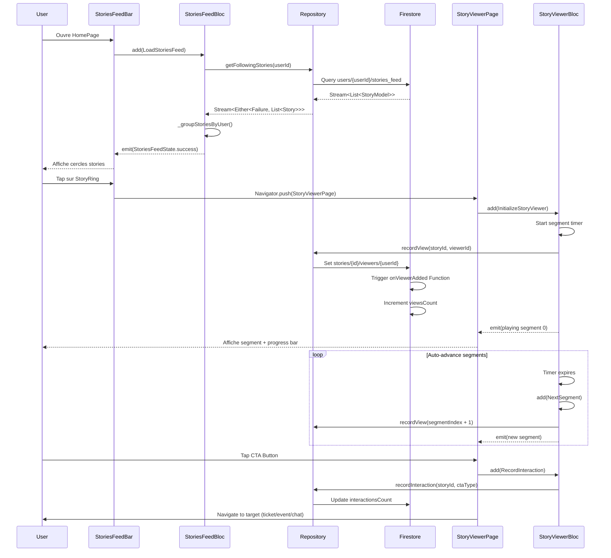
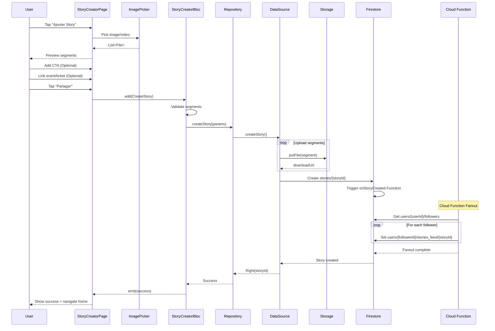
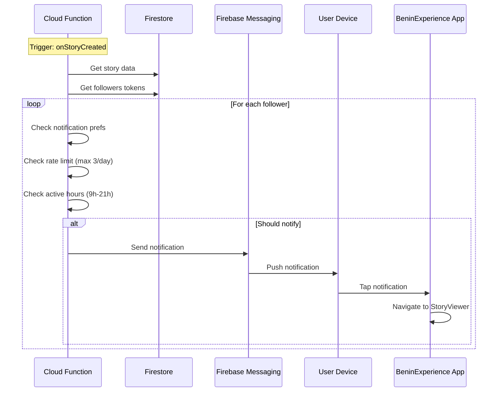
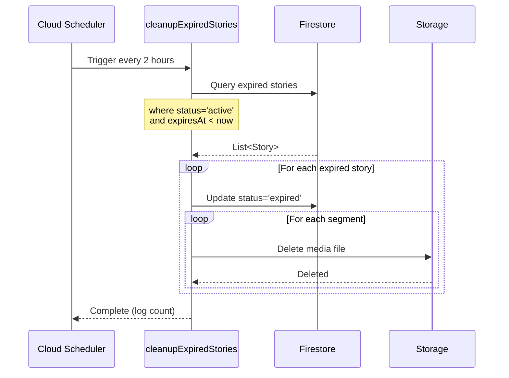
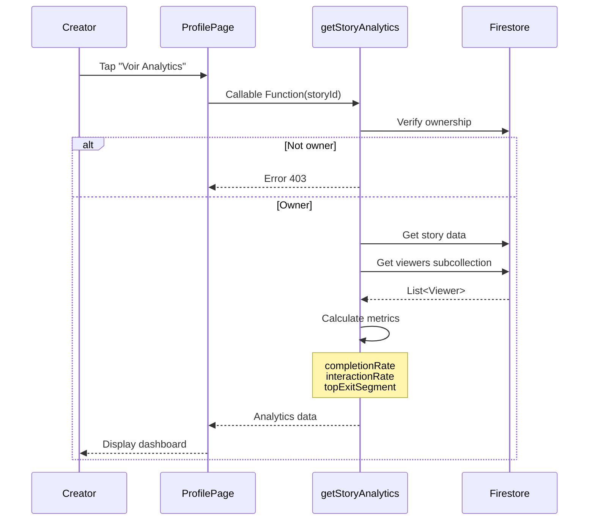
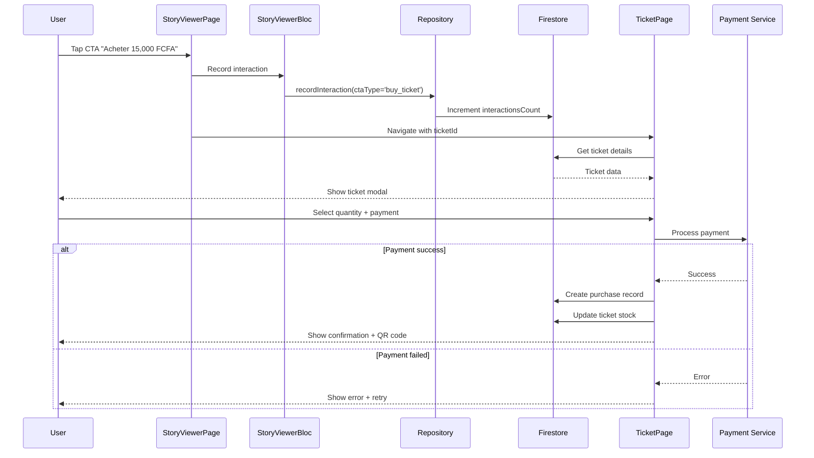
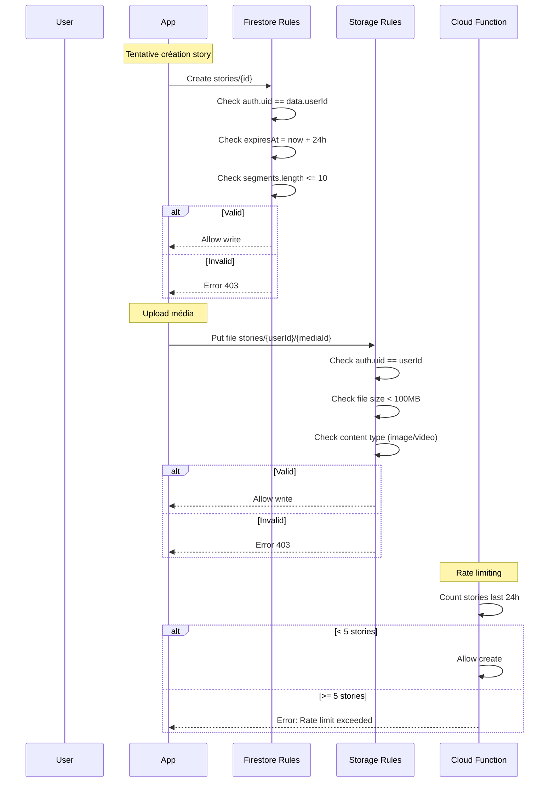
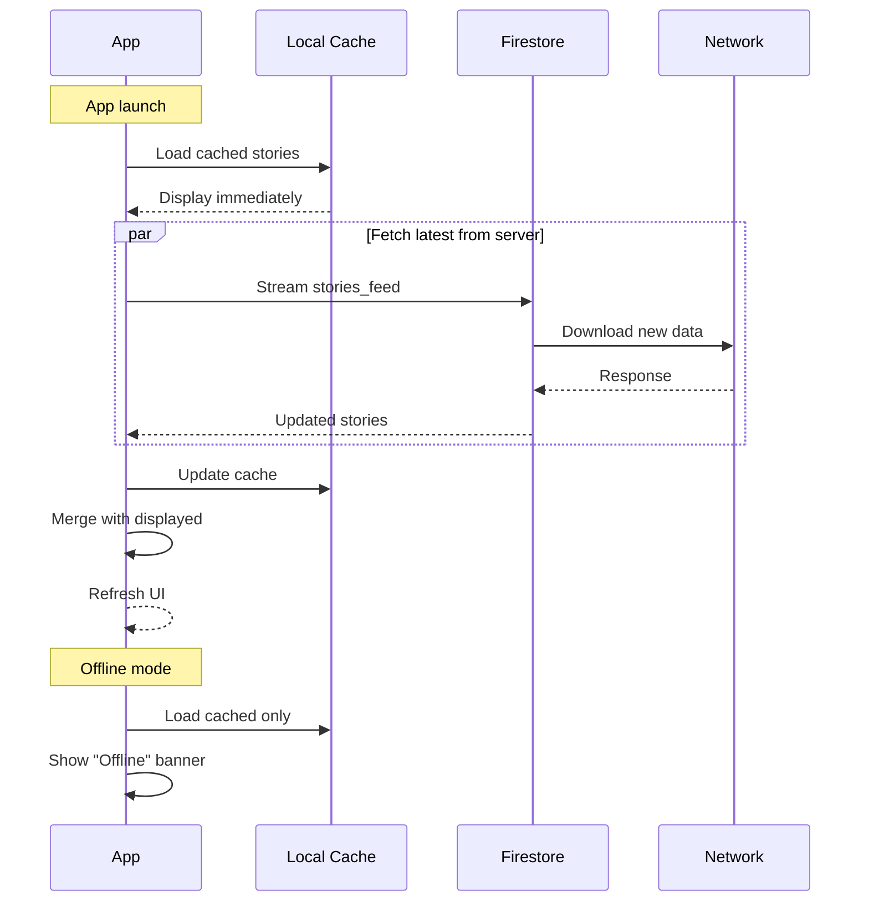

# 📊 STORIES - DIAGRAMMES DE SÉQUENCE
## Flux Techniques Détaillés

---

## 🎬 FLUX 1: VOIR UNE STORY



---

## 📤 FLUX 2: CRÉER UNE STORY



---

## 🔔 FLUX 3: NOTIFICATION PUSH STORY



---

## 🗑️ FLUX 4: CLEANUP STORIES EXPIRÉES



---

## 📊 FLUX 5: ANALYTICS STORY (Créateur)



---

## 🎯 FLUX 6: INTERACTION CTA (Acheter Billet)



---

## 🔄 FLUX 7: STATES & TRANSITIONS (BLoC)

### **StoriesFeedBloc**
```
[Initial]
   ↓ LoadStoriesFeed
[Loading] ← → [Success]
   ↓              ↑
[Failure]    RefreshFeed
```

### **StoryViewerBloc**
```
[Initial]
   ↓ InitializeStoryViewer
[Playing Segment 0]
   ↓ NextSegment
[Playing Segment 1]
   ↓ PauseSegment
[Paused]
   ↓ PlaySegment
[Playing Segment 1]
   ↓ ... NextSegment
[Completed] → Navigator.pop()
```

---

## 🔐 FLUX 8: SÉCURITÉ & VALIDATION



---

## 📱 FLUX 9: GESTURES & INTERACTIONS

```
User Actions → StoryViewerBloc Events
━━━━━━━━━━━━━━━━━━━━━━━━━━━━━━━━━━━━

Tap Left (x < 33%)      → PreviousSegment
Tap Center (33%-66%)    → [Aucune action]
Tap Right (x > 66%)     → NextSegment
Long Press Start        → PauseSegment
Long Press End          → PlaySegment
Swipe Down              → CompleteStory → Navigator.pop()
Swipe Up (Phase 2)      → ShowDetails
Double Tap (Phase 2)    → LikeStory
Tap CTA Button          → RecordInteraction + Navigate
```

---

## 🔄 FLUX 10: SYNC & CACHE



---

## 📈 MÉTRIQUES & EVENTS

### **Analytics Events Flow**
```
Story View:
User taps StoryRing
   ↓
StoryViewerBloc.initializeStoryViewer()
   ↓
Analytics.logEvent('story_view', {
  story_id,
  viewer_id,
  source: 'feed' | 'profile' | 'notification'
})
   ↓
Firestore: stories/{id}/viewers/{userId}
   ↓
Cloud Function: onViewerAdded
   ↓
Update viewsCount

CTA Click:
User taps CTA Button
   ↓
Analytics.logEvent('story_cta_click', {
  story_id,
  cta_type,
  target_id
})
   ↓
recordInteraction()
   ↓
Update interactionsCount
```

---

## 🎯 ÉTATS & ERREURS

### **Gestion Erreurs par Layer**

```
UI Layer (Presentation)
   ↓ User action fails
   ↓ Show SnackBar or Dialog
   
BLoC Layer
   ↓ Use case returns Left(Failure)
   ↓ emit(ErrorState(message))
   
Domain Layer
   ↓ Repository returns Failure
   ↓ Either<Failure, Success>
   
Data Layer
   ↓ Datasource throws Exception
   ↓ Catch → ServerException
   ↓ Repository converts to Failure
```

### **Types de Failures**
```dart
abstract class Failure {
  ServerFailure       // Firestore down
  NetworkFailure      // No internet
  CacheFailure        // Local storage error
  ValidationFailure   // Invalid input
  PermissionFailure   // Auth/rules denied
  RateLimitFailure    // Too many requests
  UnexpectedFailure   // Unknown error
}
```

---

✅ **TOUS LES FLUX TECHNIQUES DOCUMENTÉS** 📊
